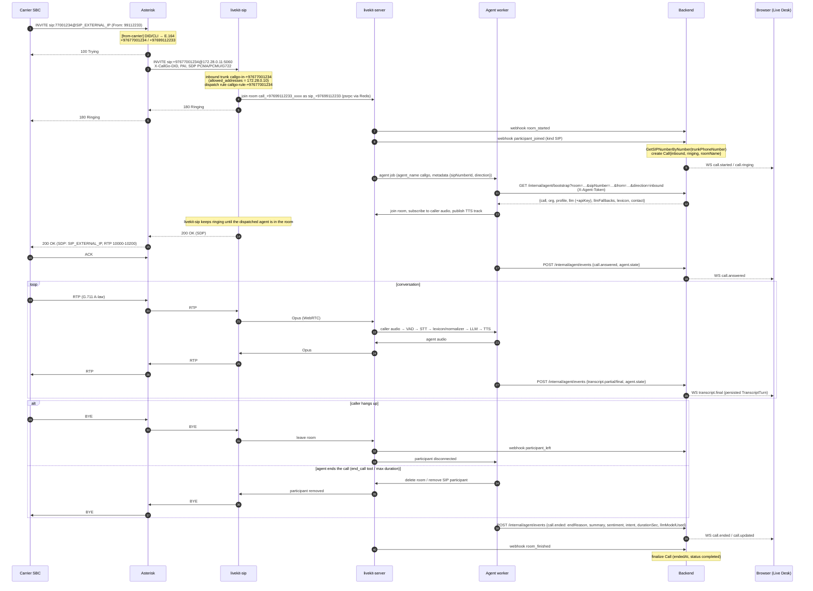
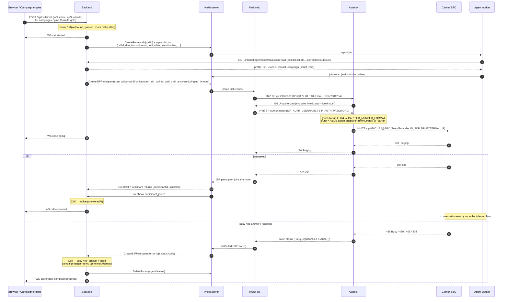
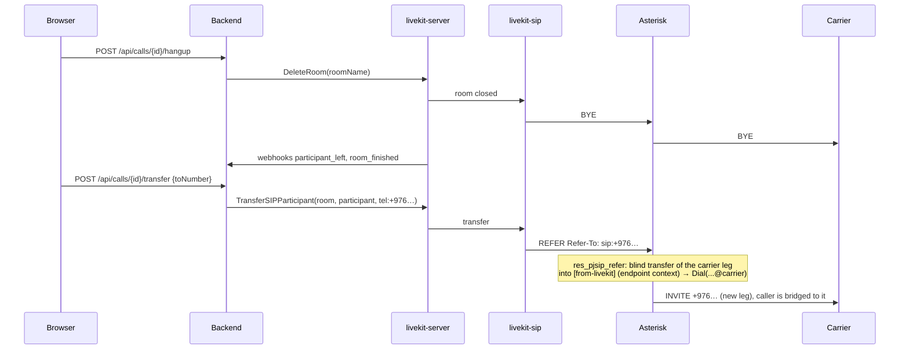
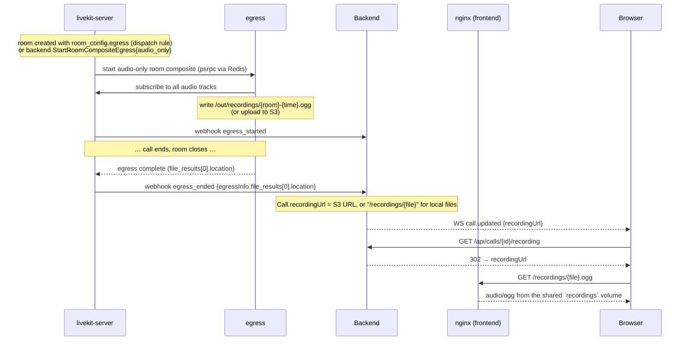

# CallGo.mn — SIP call flows / Дуудлагын урсгал

How a phone call travels through **Carrier → Asterisk → livekit-sip →
livekit-server → agent → backend → browser**, for inbound and outbound calls,
including webhooks and internal API calls. Configuration details:
[ASTERISK.md](ASTERISK.md), [DEPLOY.md](DEPLOY.md); API contract: [API.md](API.md),
events: [EVENTS.md](EVENTS.md).

The inbound and outbound SIP legs (Asterisk ⇄ livekit-sip ⇄ livekit-server,
webhooks, room naming) were exercised against the real Asterisk 22.10.1,
livekit-sip v1.17 and livekit-server v1.13.7 binaries with a simulated carrier.

## Identifiers / Танигч

| Thing | Value | Set by |
|---|---|---|
| Inbound room | `call_<caller E.164>_<random>` e.g. `call_+97699112233_S4ccFjTJAfSr` | dispatch rule `dispatch_rule_individual{room_prefix:"call"}` |
| Outbound room | `call-<callId uuid>` | backend (`RoomNameForCall`) |
| SIP participant (inbound) | identity `sip_<caller>`, kind `SIP`, attributes `sip.phoneNumber`, `sip.trunkPhoneNumber`, `callgo.direction=inbound`, `callgo.sipNumberId` | livekit-sip + dispatch rule `attributes` |
| SIP participant (outbound) | identity chosen by the backend, attributes `callgo.callId`, `callgo.direction=outbound` | `CreateSIPParticipant` |
| Agent job metadata (inbound) | `{"sipNumberId":"…","direction":"inbound"}` | dispatch rule `room_config.agents[0].metadata` |
| Agent job metadata (outbound) | `{"callId","direction":"outbound","toNumber","fromNumber","sipNumberId","agentProfileId",…}` | backend `CreateRoom` agent dispatch |
| LiveKit SIP objects | `callgo-in-<E.164>`, `callgo-rule-<E.164>`, `callgo-out-<E.164>` | backend `EnsureNumberProvisioned` / `lk-setup.sh` |
| Asterisk channel | `PJSIP/carrier-…` (PSTN leg), `PJSIP/livekit-…` (LiveKit leg) | Asterisk |

---

## 1. Inbound call / Орж ирэх дуудлага

Failure cases on the inbound side:

| Where | What the carrier sees |
|---|---|
| No LiveKit inbound trunk for the DID | livekit-sip rejects (404 / 403) → `Hangup(${HANGUPCAUSE})` relays it |
| Asterisk IP not in `allowed_addresses` | 403 from livekit-sip |
| No agent worker online | ringing until Asterisk's `INBOUND_RING_TIMEOUT` (45 s) → no answer |
| livekit-sip unreachable | Asterisk qualify marks `livekit` unavailable → 503/480 |

---

## 2. Outbound call (manual dial or campaign) / Гарах дуудлага

---

## 3. Operator actions from the CRM / CRM-ээс хийх үйлдэл

---

## 4. Recording / Бичлэг (profile `recording`)

---

## 5. Ports on the path / Замын портууд

| Hop | Transport | Ports |
|---|---|---|
| Carrier ⇄ Asterisk | SIP UDP / RTP | 5060/udp, 10000-10200/udp (public, published) |
| Asterisk ⇄ livekit-sip | SIP UDP / RTP | 172.28.0.10:5060 ⇄ 172.28.0.11:5060, RTP 10000-10200 on both containers (private) |
| livekit-sip, agent, egress ⇄ livekit-server | WebSocket + WebRTC | ws://livekit:7880, ICE UDP 50000-50100 / TCP 7881 (internal candidates) |
| livekit-sip, egress ⇄ livekit-server | psrpc | Redis `redis:6379` |
| livekit-server → backend | HTTP webhooks (JWT signed with LIVEKIT_API_KEY/SECRET) | http://backend:8080/api/livekit/webhook |
| agent → backend | HTTP, `X-Agent-Token` | http://backend:8080/internal/agent/* |
| backend → agent | HTTP (LLM test) | http://agent:8090/test-llm |
| browser → nginx → backend | HTTPS / WSS | 443 → frontend:80 → backend:8080 (`/api`, `/api/ws`) |
